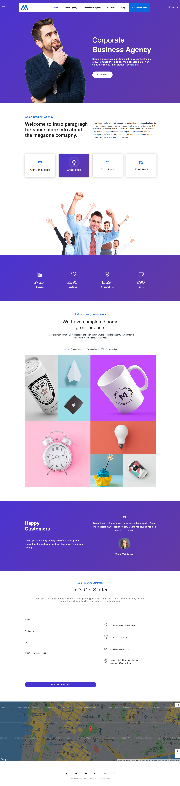

<h1>Empresa</h1>

El ejercicio consiste en maquetar el siguiente boceto utilizando Bootstrap 5 y una hoja de estilo propia siguiendo la filosofía mobile first.

En el siguiente enlace tiene la maquetación original, para que pueda copiar textos, imágenes y efectos hover.

<a src="https://megaone.acrothemes.com/index-gradient-agency.html">https://megaone.acrothemes.com/index-gradient-agency.html</a>

Debe tener en cuenta lo siguiente:

<ul>
    <li>No puede copiar HTML de la maquetación original.</li>
    <li>Debe crear una maquetación estática, sin efectos JS. Las únicas animaciones deben ser por hover y los acordeones (tabs).</li>
    <li>Su hoja de estilo no debe ser muy larga, siempre que pueda deberá utilizar la CSS de Bootstrap 5</li>
    <li>Deberá comprobar que la maquetación es correcta para los tamaños XS, SM, MD y LG.</li>
</ul>

